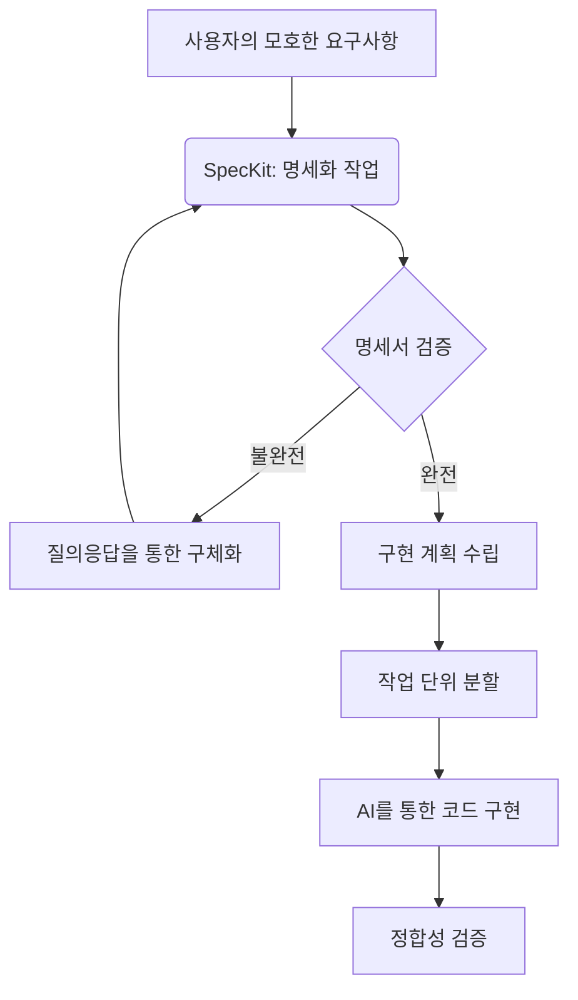

# 1강: Spec-Driven Development(SDD)의 이해

## 개요
Spec-Driven Development(SDD, 명세 주도 개발)는 AI 에이전트를 활용한 소프트웨어 개발에서 흔히 발생하는 환각(Hallucination) 현상과 방향성 상실을 방지하기 위해, 명확한 '명세(Specification)'를 기반으로 개발을 진행하는 패러다임입니다. 이 과정에서 SpecKit은 자연어 기반의 모호한 요구사항을 구조화된 마크다운 문서로 변환하고, AI가 이를 강제적으로 준수하도록 통제하는 핵심 프레임워크 역할을 수행합니다.

## 학습목표
- Spec-Driven Development(SDD)의 핵심 개념과 필요성 이해
- AI 환각(Hallucination) 제어 원리 파악
- SpecKit의 역할과 기본 워크플로우 이해

## 사용형식 / 메뉴얼
SDD를 실무에 적용하기 위해서는 다음과 같은 단계를 거치게 됩니다.



SpecKit은 각 단계를 통제하기 위해 다음과 같은 규칙과 프로세스를 제공합니다:
- **불변 원칙(Constitution)**: AI가 지켜야 할 일관된 코딩 컨벤션, 기술 스택 등을 명시
- **문서화된 명세(Specification)**: 기획 의도와 기술적 요구사항을 분리하여 마크다운 포맷으로 작성
- **체크리스트 기반 작업(Tasks)**: 검증 가능한 최소 단위로 작업을 할당하여 AI의 이탈을 방지

## 직접해보기
SDD의 개념을 이해하기 위해 간단한 사고 실험(Thought Experiment)을 진행해봅시다.

**Step 1: 일반적인 AI 프롬프팅 (문제점 확인)**
일반적인 AI에게 "게시판 만들어줘"라고 지시하면, AI는 임의의 언어(예: PHP), 임의의 DB, 임의의 디자인으로 결과물을 생성합니다. 이는 사용자의 의도와 다를 확률이 매우 높습니다.

**Step 2: SDD 기반 프롬프팅 구조화 (해결책 적용)**
SpecKit의 사고방식을 빌려 명세서를 먼저 작성해 봅니다.

1. **What (무엇을)**: 회원 전용 익명 게시판
2. **Rules (규칙)**: 
    - 언어: JavaScript (Node.js)
    - 프레임워크: Express
    - 데이터베이스: MongoDB
3. **Tasks (작업 목록)**:
    - [ ] 1. 프로젝트 폴더 초기화 및 패키지 설치
    - [ ] 2. Express 서버 기본 라우팅 구성
    - [ ] 3. MongoDB 연결 설정
    - [ ] 4. 게시글 스키마 정의

이러한 명세를 AI에게 먼저 검토하게 하고, 각 체크리스트 항목별로 하나씩 코드를 생성하도록 지시하면 환각 없이 정확한 결과물을 얻을 수 있습니다.

## 실전 예제

**예제 1. SpecKit 기본 초기화 명세 확인**
`specify init` 후 생성되는 기본 명세 샘플을 확인합니다.
```bash
cat specs/spec.md
```
*(기본적인 What, Why 구조가 예시로 들어있습니다.)*

**예제 2. AI에게 규칙 주입 상태 검증**
에이전트에게 룰을 적용한 후 잘 인식하는지 테스트합니다.
```bash
specify check --dry-run
```
*(적용된 규칙과 명세가 올바른 마크다운 구조인지 로컬에서 검증합니다.)*

**예제 3. 환각 발생 시나리오 테스트**
의도적으로 모호한 명령어("대충 게시판 하나 만들어")를 백그라운드 AI에 던지는 스크립트를 실행해 봅니다.
```bash
echo "대충 만들어줘" > mock-prompt.txt && specify run --prompt mock-prompt.txt
```
*(결과: SDD 룰에 의해 에러를 반환하며 명세를 요구하는지 확인합니다.)*

## Tips 
- **주의사항**: 처음부터 너무 방대한 명세를 작성하려고 하지 마세요. 작은 모듈 단위로 명세를 나누고 구현을 반복하는 것이 오류를 줄이는 지름길입니다.
- **다이나믹한 활용법**: SpecKit을 사용할 때는 AI가 명세서를 작성하도록 유도할 수 있습니다. "내가 만든 기획안을 바탕으로 SpecKit 형식의 명세서를 작성해줘"라고 요청해보세요.
- **성능을 높이는 방법**: 요구사항 문서에 모호한 형용사('빠르게', '예쁘게') 대신 구체적인 수치나 명확한 기준('응답시간 200ms 이하', 'TailwindCSS의 slate-800 색상 사용')을 포함하면 일관된 결과를 얻을 수 있습니다.

## 다음강좌 소개
- **[2강: 개발 환경 셋업]** Mac 환경에서 Python 패키지 관리자(`uv`) 및 `specify-cli` 설치, AI 에이전트와 SpecKit을 실제로 연동하는 실습을 진행합니다.
