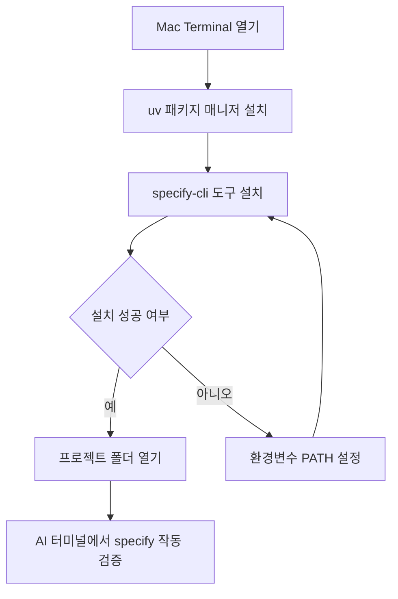

# 2강: 개발 환경 셋업

## 개요
SpecKit을 원활하게 사용하기 위해서는 빠른 환경 구성 도구인 패키지 관리자 `uv`를 활용하여 `specify-cli`를 설치해야 합니다. 이번 챕터에서는 Mac 환경을 기준으로 SpecKit 개발 환경을 구축하고, 이를 실제 AI 에이전트(예: Cursor, Cline, Windsurf 등)와 연동하는 과정을 다룹니다.

## 학습목표
- Python 초고속 패키지 관리자인 `uv`의 설치와 기본 개념 파악
- SpecKit 코어 도구인 `specify-cli` 시스템 전역 설치
- AI 에이전트 내장 터미널에서 SpecKit 명령어를 문제없이 호출할 수 있도록 환경 검증

## 사용형식 / 메뉴얼

개발 환경 구축의 전체 흐름은 다음과 같습니다.



터미널에서 사용하게 될 주요 명령어들은 다음과 같습니다.
- `uv`: Rust 기반의 매우 빠르고 안정적인 Python 패키지 및 프로젝트 환경 관리자입니다.
- `uv tool install`: CLI 도구를 전역으로 안전하게 설치할 때 사용합니다.
- `specify`: SpecKit을 실행하는 메인 명령어입니다.

## 직접해보기

**Step 1. `uv` 설치하기**
Mac의 내장 터미널이나 iTerm2를 열고 아래 스크립트를 실행하여 `uv`를 설치합니다.

```bash
curl -LsSf https://astral.sh/uv/install.sh | sh
```
설치가 완료되면 터미널을 재시작하거나 `source ~/.zshrc`를 입력하여 환경변수를 갱신합니다. 이후 버전을 체크합니다.
```bash
uv --version
```
(정상적으로 버전 넘버가 출력되어야 합니다.)

**Step 2. `specify-cli` 설치하기**
`uv`의 `tool` 기능을 사용하여 `specify-cli`를 시스템 전역에 설치합니다. 이 방식은 다른 Python 패키지와 충돌할 위험을 완전히 차단합니다.

```bash
uv tool install specify-cli
```
설치가 되었다면 `specify --help`를 입력해 정상 동작 여부를 확인합니다.

**Step 3. AI 에이전트와 연동 테스트**
1. 사용 중인 AI 에이전트 (예: Cursor IDE 등)를 실행하여 비어있는 작업 폴더를 엽니다.
2. 에이전트 화면 내의 터미널(Terminal) 창을 열고 `specify --version`을 실행해봅니다.
3. 명령어 에러(`command not found`)가 난다면, 시스템 터미널과 경로(PATH) 설정이 달라서 발생한 것이므로 AI 에이전트를 완전히 종료한 후(Command + Q) 다시 시작하여 `.zshrc`를 다시 로드하게 구성합니다.
4. 아래 명령어로 프로젝트를 초기화하여 추후 과정에 진입할 준비를 마칩니다.
```bash
specify init
```

## 실전 예제

**예제 1. uv를 통한 가상환경 생성 및 패키지 설치**
명세 기반 프로젝트를 위한 격리된 Python 환경을 만듭니다.
```bash
uv venv .venv
source .venv/bin/activate
uv pip install fastapi uvicorn
```

**예제 2. specify-cli 특정 버전 설치**
프로젝트의 호환성을 위해 CLI 도구를 고정 버전으로 설치합니다.
```bash
uv tool install specify-cli@1.2.0
```

**예제 3. AI 에이전트 내 전역 룰(Rules) 연동 파일 생성**
Cursor나 Cline에서 읽을 수 있는 `.cursorrules` 또는 `.clinerules`를 만들어 SpecKit 명령어 사용을 강제합니다.
```bash
echo "Always use 'uv' for python operations. Run 'specify check' before major commits." > .cursorrules
```

## Tips 
- **주의사항**: Mac의 기본 쉘은 `zsh`입니다. 만약 `uv` 설치 후 경로 문제가 생긴다면 `~/.zshrc` 혹은 `~/.zprofile` 파일 하단에 `export PATH="$HOME/.cargo/bin:$PATH"` 형식의 패스가 등록되어 있는지 꼭 확인하세요.
- **도구를 좀더 다이나믹하게 쓰는 방법**: 프로젝트별로 독립적인 종속성 관리가 필요하다면 전역 설치 외에도, 최상위 폴더 내에서 `uv venv`를 통해 가상환경을 생성하여 프로젝트 단위로만 `specify-cli`를 관리할 수도 있습니다.
- **성능을 높이는 방법**: AI 에이전트에게 **"앞으로 터미널을 통한 모든 파이썬 스크립트 도구 실행 및 구동은 `uv`를 활용해줘"** 라고 미리 프롬프트나 전역 규칙(`Rules for AI`)에 명확하게 지정해두면, AI가 알아서 가장 빠른 속도로 패키지를 관리하고 종속성 충돌을 차단해줍니다.

## 다음강좌 소개
- **[3강: 코어 폴더 구조 파헤치기]** 에서는 `specify init` 이후 프로젝트 내에 생성되는 `.specify` 숨김 폴더 안의 `memory`, `templates` 역할과 실제 명세서 산출물들이 저장되는 `specs` 폴더 구조를 심층적으로 분석하며 프로젝트 기본 구조를 이해합니다.
