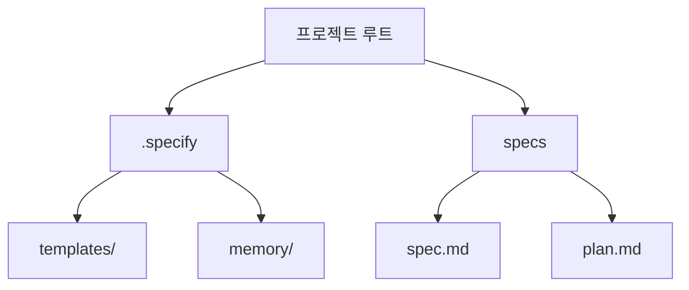

# 3강: 코어 폴더 구조 파헤치기

## 개요
SpecKit 프로젝트를 초기화하면 생성되는 필수 디렉토리인 `.specify`와 `specs` 구조를 깊이 이해합니다. AI가 문맥을 기억하는 방식과 템플릿 작동 원리를 파악하여 프로젝트 생태계를 통제할 수 있습니다.

## 학습목표
- `.specify` 코어 디렉토리의 내부 구조 파악
- AI 기록소인 `memory` 폴더 원리 이해
- 명세가 저장되는 `specs` 폴더와의 관계 인지

## 사용형식 / 메뉴얼



## 직접해보기

**Step 1. 디렉토리 검토**
터미널에서 `specify init` 실행 후 `.specify` 폴더 내부를 직접 확인하세요.

**Step 2. templates 열어보기**
`.specify/templates` 안의 프롬프트를 구경하여 AI 지시문이 어떻게 구성되어 있는지 살펴봅니다.

## 실전 예제

**예제 1. `.specify` 숨김 폴더 트리 구조 확인**
초기화된 코어 폴더의 전체 하위 구조를 눈으로 확인합니다.
```bash
tree -a .specify
```
*(결과: memory, templates 폴더와 하위 파일들이 노출됩니다.)*

**예제 2. 사용자 커스텀 템플릿 복사**
팀 내부적으로 쓸 커스텀 템플릿을 `templates/`에 복사합니다.
```bash
mkdir -p .specify/templates/custom
cp ~/my-templates/react-spec.md .specify/templates/custom/
```

**예제 3. memory 로그 초기화**
AI 컨텍스트가 너무 꼬여서 리셋하고 싶을 때 memory 파일을 비웁니다.
```bash
rm -rf .specify/memory/*
echo "Memory cleared."
```

## Tips 
- **주의사항**: `.specify` 내 파일을 임의 삭제하면 안 됩니다.
- **다이나믹한 활용법**: `templates` 내 프롬프트를 입맛에 맞게 커스텀하여 룰을 강제할 수 있습니다.
- **다음강좌 소개**: **[4강: 프로젝트 불변 원칙 수립]**에서 AI 절대 규칙(헌법) 작성법을 배웁니다.
