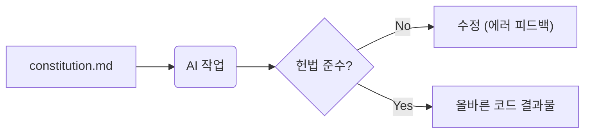

# 4강: 프로젝트 불변 원칙 수립 (/speckit.constitution)

## 개요
프로젝트 불변 원칙(Constitution)은 SDD의 핵심 기반으로, AI가 설계 및 코딩 시 '어떤 기술과 컨벤션을 지켜야 하는지' 고정시키는 헌법입니다.

## 학습목표
- Constitution 개념 및 중요성 파악
- `constitution.md` 작성법 습득
- AI의 강제 준수 원리 이해

## 사용형식 / 메뉴얼

### 1. 아무것도 없는 환경에서 Constitution 파일 생성하기
프로젝트 초기화조차 되지 않은 빈 디렉토리에서 시작할 때, 가장 먼저 기반(Foundation)을 잡는 방법입니다.
1. 터미널을 열고 새 프로젝트 폴더를 만듭니다. `mkdir my-app && cd my-app`
2. SpecKit 환경을 초기화합니다. `specify init`
3. 초기화 후 생성된 `specs/` (혹은 명세 폴더) 디렉토리 내에 직접 `constitution.md` 파일을 생성하거나, AI 에이전트 챗에 "우리가 쓸 Next.js 스택에 맞는 constitution 기본 템플릿을 만들어줘"라고 지시하여 뼈대를 잡습니다.

### 2. Constitution 파일의 구조
이 파일은 크게 **어떤 기술을 쓸 것인가(Tech Stack)**, **어떤 코딩 원칙을 지킬 것인가(Rules & Conventions)**, **무엇을 절대 하지 말아야 하는가(Anti-patterns)** 세 가지 논리적 구조로 나뉩니다.



### 3. 업무에 바로 적용 가능한 완벽한 샘플 2선

**샘플 A: 프론트엔드(React/Next.js) 특화 헌법**
```markdown
# Frontend Constitution

## 1. Tech Stack
- Framework: Next.js 14 (App Router)
- Language: TypeScript (Strict mode)
- Styling: Tailwind CSS

## 2. Coding Conventions
- 모든 UI 컴포넌트는 Functional Component와 Arrow Function 체계를 사용한다.
- `any` 타입 사용을 엄격히 금지하며, API 응답 등 모든 구조체는 반드시 `interface`로 선언한다.
- 전역 상태 관리는 Zustand 라이브러리를 사용한다.

## 3. Anti-Patterns (금지 사항)
- 렌더링 성능 최적화를 위해 인라인 스타일(inline style 객체화)을 절대 사용하지 않는다.
```

**샘플 B: 백엔드(Node.js/Express) 특화 헌법**
```markdown
# Backend & DB Constitution

## 1. Tech Stack
- Runtime: Node.js 20 LTS
- Web Framework: Express.js
- Database: PostgreSQL (ORM: Prisma)

## 2. Architecture & Patterns
- 코드는 철저하게 3계층(Controller - Service - Repository) 패턴으로 분리하여 작성한다.
- Error Handling: 모든 라우터 로직은 상위의 글로벌 에러 미들웨어를 거치도록 구성하고, try-catch 블록을 필수로 작성한다.

## 3. Security Rules (최우선!)
- 쿼리 실행 시 SQL 인젝션을 막기 위해 ORM의 기본 메서드나 Parameter Binding 방식을 강제한다.
- 패스워드 등 민감 정보는 DB 저장 전 12-round bcrypt로 단방향 해싱한다.
```

## 직접해보기

**Step 1. 헌법 작성**
`specs/constitution.md` 파일을 만들고 아래 코드를 기입합니다.
```markdown
# Tech Stack
- Frontend: React
- Backend: Node.js
# Conventions
- No `any` in TypeScript.
```
**Step 2. AI 주입**
"헌법을 읽고 앞으로의 모든 작업에 적용해"라고 AI에게 지시합니다.

## 실전 예제

**예제 1. Backend 전용 헌법 파일 생성**
기술 스택에 따른 엄격한 헌법 파일을 만듭니다.
```bash
mkdir -p specs
cat << 'EOF' > specs/constitution.md
# Backend Rules
1. MUST use Express.js
2. DO NOT use async/await without try/catch
EOF
```

**예제 2. 시큐어 코딩(Secure Coding) 헌법 주입**
```bash
cat << 'EOF' >> specs/constitution.md
# Security
- All passwords must be hashed using bcrypt (12 rounds).
- Prevent SQL Injection using parameterized queries.
EOF
```

**예제 3. 헌법 린팅(Linting) 검사**
작성된 `constitution.md`가 SpecKit 파서에 의해 정상 인식되는지 확인합니다.
```bash
specify validate --file specs/constitution.md
```

## Tips 
- **주의사항**: 너무 방대한 규칙은 컨텍스트를 과적시킵니다.
- **다이나믹한 활용법**: 시큐어 코딩 철칙(비밀번호 암호화 등)을 추가하여 보안을 자동화하세요.
- **다음강좌 소개**: **[5강: 비즈니스 요구사항 명세]**에서 실제 기획(What)을 작성해봅니다.
