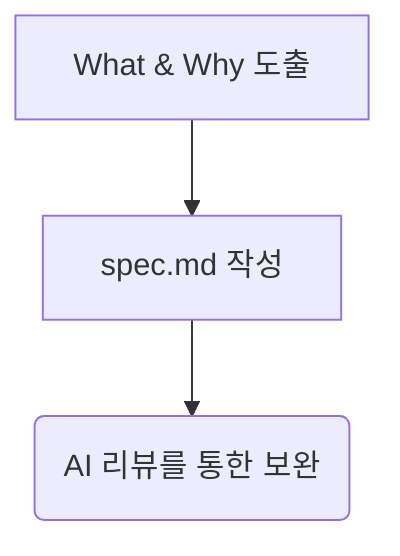

# 5강: 비즈니스 요구사항 명세 (/speckit.specify)

## 개요
기술적 부분(How)은 배제하고, "무엇을 만들고 왜 만드는가(What & Why)"라는 비즈니스 논리에 집중하여 명세서를 작성합니다.

## 학습목표
- `spec.md` 목적 이해
- 기술 구현 배제 및 비즈니스 목적 도출 훈련
- `/speckit.specify` 명령어 활용

## 사용형식 / 메뉴얼



## 직접해보기

**Step 1. 기획안 작성**
`specs/spec.md`에 목적을 씁니다.
```markdown
## Why
고객이 결제를 빠르게 마치도록 이탈률 최소화

## What
1. 회원가입 없이 장바구니 이용 가능
2. 장바구니 페이지 내 즉시 수량 조절
```
**Step 2. 명령어 실행**
AI 챗에 `/speckit.specify`를 입력하여 AI가 초안 구조를 교정하게 시킵니다.

## 실전 예제

**예제 1. BDD(Behavior Driven) 패턴의 spec.md 생성**
Given-When-Then 문법을 차용하여 요구사항을 파일로 생성합니다.
```bash
mkdir -p specs
cat << 'EOF' > specs/spec.md
## What (카트 담기 로직)
- Given: 비어있는 장바구니
- When: 사용자가 '추가' 버튼 클릭
- Then: 장바구니에 아이템 1개가 노출된다.
EOF
```

**예제 2. 명세서(spec) 자동 번역 생성**
AI를 활용해 마케터가 쓴 기획안(`raw.txt`)을 SpecKit 규격으로 변환합니다.
```bash
echo "마케팅팀 요구사항: 세일 기간 중에는 쿠폰이 자동 적용되게 해주세요." > raw.txt
specify generate spec --input raw.txt --output specs/spec.md
```

**예제 3. 명세 파일의 Git 추적 확인**
명세 파일들은 형상관리가 되어야 하므로 git status로 추적 상태를 확인합니다.
```bash
git add specs/spec.md
git commit -m "docs: 초기 비즈니스 명세서 작성"
```

## Tips 
- **주의사항**: 어떤 데이터베이스를 쓸 것인지 등 기술 스택은 절대 적지 마세요.
- **다이나믹한 활용법**: 핵심 페르소나를 `Why`에 입력하면 극강의 엣지 케이스를 잡습니다.
- **다음강좌 소개**: **[6강: 요구사항 구체화]**에서 AI의 깐깐한 질문을 통해 기획안 빈틈을 메웁니다.
