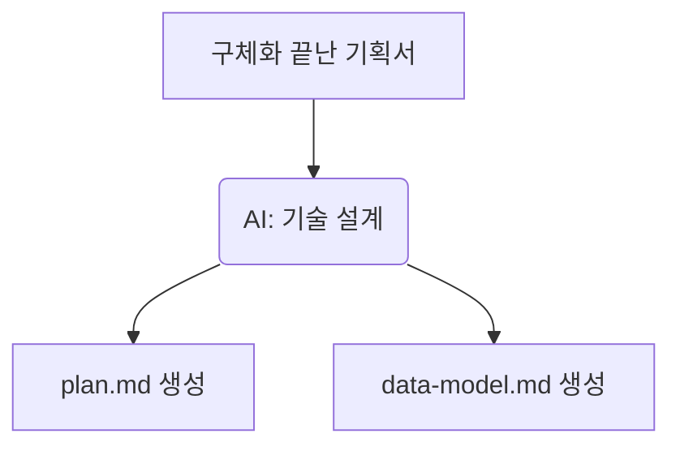

# 7강: 기술적 구현 계획 수립 (/speckit.plan)

## 개요
완성된 기획서와 헌법을 종합하여 AI가 구체적인 기술적 아키텍처, 폴더 구조, 스키마 등을 설계하는 단계입니다.

## 학습목표
- `plan.md` 및 `data-model.md` 설계 목적 상기
- 기술 아키텍처 수립의 자동화 요령
- 설계서 사전 리뷰의 필요성 인지

## 사용형식 / 메뉴얼



## 직접해보기

**Step 1. 계획 설계 지시**
`/speckit.plan` 명령어로 아키텍처 및 DB 스키마 초안 산출을 요구합니다.

**Step 2. 문서 리뷰/개선**
AI가 만들어준 폴더 구조와 스키마를 훑어봅니다. 데이터 타입이 마음에 안 든다면 이 단계에서 수정 요청을 합니다. ("userId는 숫자형이 아니라 uuid로 변경해")

## 실전 예제

**예제 1. plan.md 산출 명령어 실행**
기획서를 바탕으로 기술 계획서를 자동 완성합니다.
```bash
specify plan --output specs/plan.md
```

**예제 2. 아키텍처 다이어그램 포함 지시**
프롬프트 옵션을 통해 mermaid 포맷의 다이어그램을 필수로 포함하도록 만듭니다.
```bash
specify plan --include-diagrams true
```

**예제 3. 특정 기술 스택(프레임워크) 강제**
계획서 생성 시 `--context`를 줘서 구조를 강제합니다.
```bash
specify plan --context "Next.js 14 App Router 구조에 맞춰서 계획해"
```

## Tips 
- **주의사항**: 구조가 비대해진다면 "디자인 패턴 단순화"를 요청하여 다이어트하세요.
- **다이나믹한 활용법**: 모르는 API 연동이 있다면 `research.md` 분석도 함께 지시하여 사전 조사를 끝마치세요.
- **다음강좌 소개**: 기획과 설계가 만났으니 시공을 위해 조각을 내는 **[8강: 액션 가능한 작업 분할]**로 넘어갑니다.
