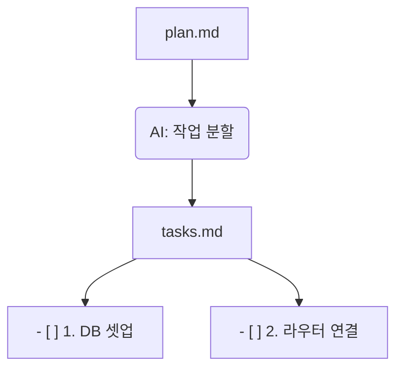

# 8강: 액션 가능한 작업 분할 (/speckit.tasks)

## 개요
설계도라도 한 번에 코딩할 수 없습니다. AI가 하나씩 수행할 수 있는 아주 작은 체크리스트인 `tasks.md`로 개발 범위를 쪼개야만 지시를 정확히 수행할 수 있습니다.

## 학습목표
- 마이크로 태스킹(Micro-Tasking) 전략 체화
- 선후 인과 관계에 입각한 태스크 도출

## 사용형식 / 메뉴얼



## 직접해보기

**Step 1. 분할 수행**
AI 창에 `/speckit.tasks`를 입력하고 가장 세분화된 체크리스트 산출을 시킵니다.

**Step 2. 로직 흐름 리뷰**
DB보다 컨트롤러 코드가 먼저 작성되지 않도록, 구현의 인과적 선후 순서가 제대로 맞는지 살펴보고 필요한 경우 인간이 수정합니다.

## 실전 예제

**예제 1. 태스크 목록 생성**
수립된 plan을 바탕으로 구체적인 실행 체크리스트를 뽑아냅니다.
```bash
specify tasks generate --plan specs/plan.md --output specs/tasks.md
```

**예제 2. 티셔츠 사이즈(T-shirt Sizing)로 태스크 크기 제한**
AI가 태스크를 너무 크게 쪼개지 못하도록 가장 작은 단위(XS, S 사이즈)로 쪼개게 지시합니다.
```bash
specify tasks generate --max-size "Small" 
```

**예제 3. 백엔드 우선순위 강제(Backend-first)**
태스크 리스트에서 API나 DB 작업이 앞쪽으로 오게 정렬합니다.
```bash
specify tasks sort --strategy "backend-first"
```

## Tips 
- **주의사항**: 작업 하나가 너무 거대하면 AI는 방향을 잃습니다. 컴포넌트/엔드포인트 1개 단위로 잘라야 합니다.
- **다이나믹한 활용법**: Backend-First 방식으로 프론트보다 API부터 짜도록 강제 배치할 수 있습니다.
- **다음강좌 소개**: 드디어 실제 코드를 폭격하듯 짜내는 **[9강: AI 기반 코드 구현]**를 경험할 차례입니다.
