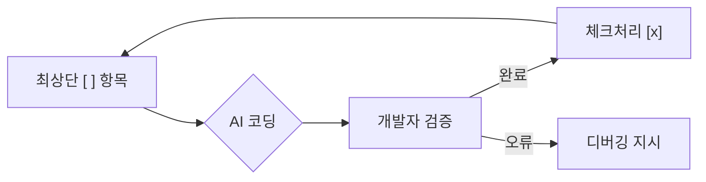

# 9강: AI 기반 코드 구현 (/speckit.implement)

## 개요
바이브 코딩의 묘미를 통제 아래에서 실행합니다. 사전에 나뉘어진 `tasks.md` 항목 하나하나를 위에서부터 순서대로 격파해나가는 과정입니다.

## 학습목표
- One-Step-at-a-time 코딩 흐름 파악
- 태스크 간 중단 및 테스트 기법 훈련
- 에러 발생 시 자가 치유(Self-healing) 프롬프팅

## 사용형식 / 메뉴얼



## 직접해보기

**Step 1. 1개 항목씩 지시**
에이전트에게 `/speckit.implement`를 구동하고 "첫 번째 체크리스트 1개만 수행 후 나에게 보고해, 절대 복수수행 안 됨"이라고 시킵니다.

**Step 2. 체크 및 릴레이**
1개 기능 구현이 코드에 반영되면 테스트해보고 완료되었다면 "체크 표시하고 다음 항목 1개만 진행해"라고 반복 핑퐁을 칩니다.

## 실전 예제

**예제 1. 단일 태스크 구현 지시**
`tasks.md`에서 미완료된 첫 번째 태스크 딱 1개만 구현하도록 제한을 겁니다.
```bash
specify implement --single-step
```

**예제 2. 중간 검증(Linting & Test) 파이프라인 연동**
코드를 생성한 후 자동으로 테스트를 돌려 에러가 나는지 점검합니다.
```bash
specify implement --post-run "npm run lint && npm test"
```

**예제 3. 에러 발생 시 자가 복구 지시**
에러 메시지를 AI에게 그대로 전달하여 방금 짠 코드를 수정하게 합니다.
```bash
specify fix --error-log ./error.log
```

## Tips 
- **주의사항**: 여러 항목을 동시 수행하려는 폭주를 단호히 제지해야 꼬이지 않습니다.
- **다이나믹한 활용법**: 진행 중 설계가 바뀌어야 한다면 `tasks.md` 중간 항목을 가볍게 수정하거나 추가하세요.
- **다음강좌 소개**: 완성 후 품질을 올리는 **[10강: 리뷰 및 정합성 검증]** 파이널 챕터입니다.
