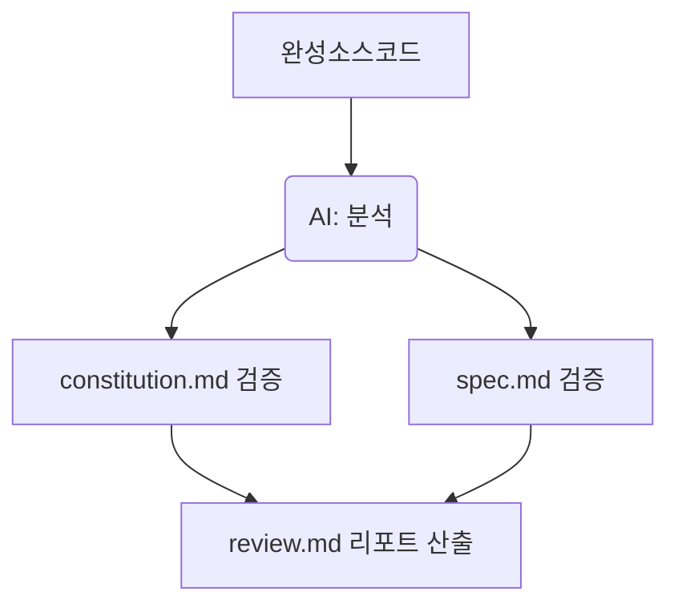

# 10강: 리뷰 및 정합성 검증 (/speckit.analyze)

## 개요
최종 완성된 코드베이스가 기획서와 헌법을 어기지 않고 잘 만들어졌는지, AI가 스스로 피어 리뷰(Peer Review)를 진행하는 단계입니다.

## 학습목표
- 정합성 교차검증(Cross-validation) 목적 이해
- 리뷰 자동화 및 리포트 도출법 숙지

## 사용형식 / 메뉴얼



## 직접해보기

**Step 1. 스캠 & 분석**
"/speckit.analyze 프로세스를 돌려줘. 내가 짠 소스와 명세서/헌법을 비교해서 안 지켜진 항목을 리포트해줘"라고 지시합니다.

**Step 2. 위배사항 개선**
산출된 분석 결과에서 '타입스크립트 any 사용' 등 헌법 위배 사항이 무자비하게 찾아집니다. 이 리포트를 근거로 AI에게 코드를 수정하게 합니다.

## 실전 예제

**예제 1. 전체 디렉토리 대상 정합성 검사**
생성된 `src` 폴더 전체가 `constitution.md`를 위반하지 않았는지 검증합니다.
```bash
specify analyze --dir src/ --rules specs/constitution.md
```

**예제 2. 기획 대비 누락 기능 도출**
`spec.md` 내용 중 구현되지 않은 비즈니스 로직을 찾아 리포트합니다.
```bash
specify analyze --compare specs/spec.md --report specs/review.md
```

**예제 3. 시큐리티 전용 패스(Security Pass) 실행**
보안 관점에서의 로직 취약성만 스니핑하여 별도로 도출합니다.
```bash
specify analyze --focus security
```

## Tips 
- **주의사항**: 파일 수가 수백 개일 경우 과부하가 옵니다. 폴더 단위로 쪼개어 리뷰를 진행하세요.
- **다이나믹한 활용법**: "시큐리티 위주로 검사해줘" 처럼 특정 역할극을 부여해 리뷰 품질을 커스텀하세요.
- **다음강좌 소개**: 이제 Part 1 초급 단계를 마스터했습니다. Part 2에 해당하는 **[11강: 애자일 워크플로우 통함]**에 편입해 실무 라이프사이클을 배옵니다.
