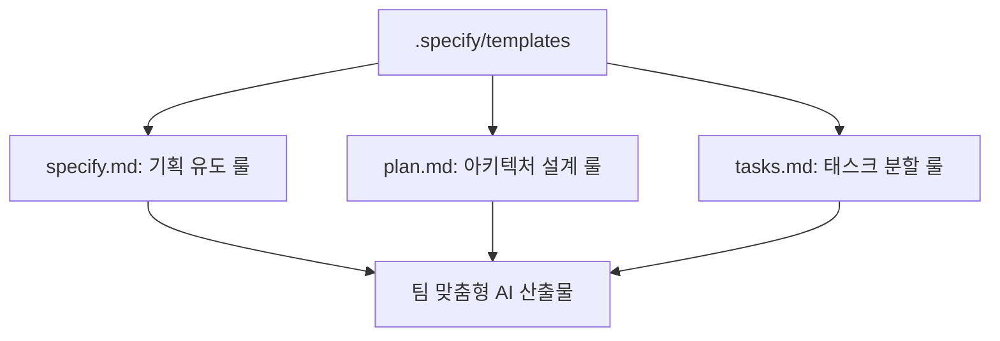

# 12강: 커스텀 템플릿(Templates) 고도화

## 개요
SpecKit 설정 폴더 내에 위치한 `templates` 파일들을 직접 수정하여, Spring, Django 등 자신이 속한 팀의 기술 스택과 응답 컨벤션에 맞게 AI의 동작 방식을 완전히 개조합니다.

## 학습목표
- `.specify/templates` 내부 파일들의 역할 분석
- 팀 맞춤형 프롬프트(Prompt) 오버라이딩 기법 익히기
- AI의 언어 톤앤매너 및 산출 방식 템플릿화

## 사용형식 / 메뉴얼



## 직접해보기

**Step 1. 템플릿 수정**
에디터로 `.specify/templates/tasks.md` (혹은 관련 프롬프트 파일)를 연 뒤 다음과 같은 문구를 추가합니다.
> "작업을 도출할 때 무조건 백엔드(Spring) 컨트롤러 생성을 프론트엔드 작업보다 위쪽 순서에 배치할 것."

**Step 2. 테스트**
설정 저장 후 다시 `tasks` 산출 명령을 내려 순서가 팀의 입맛에 맞게 개조되었는지 검증합니다.

## 실전 예제

**예제 1. 커스텀 템플릿 디렉토리 설정**
기본 제공 템플릿 대신 팀 레포지토리의 커스텀 템플릿 경로를 사용하도록 설정합니다.
```bash
specify config set templateBasePath "./my-team-templates"
```

**예제 2. 커스텀 프롬프트 파일 수정 적용**
팀 컨벤션을 담은 `tasks.md` 템플릿을 수정하고, AI 설정에 리로딩합니다.
```bash
echo "컨트롤러 단에서 반드시 DTO Validation을 포함할 것" >> .specify/templates/tasks.md
specify reload
```

**예제 3. 로컬 템플릿 검증 테스트**
수정한 템플릿이 AI에게 프롬프트 에러 없이 잘 주입되는지 확인합니다.
```bash
specify check --template tasks.md
```

## Tips 
- **주의사항**: 특수 문자나 Markdown 기호가 템플릿 내에서 꼬이지 않도록 원형을 유지하며 수정하세요.
- **다이나믹한 활용법**: 산출물을 무조건 한국어로 출력하게 하거나 특정 표(Table) 형식으로만 뽑게 지정할 수 있습니다.
- **다음강좌 소개**: 여럿이 함께할 때 충돌을 막는 **[13강: 팀 단위 협업 전략]** 입니다.
