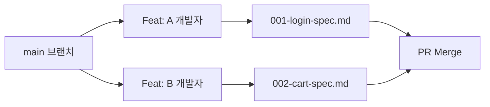

# 13강: 팀 단위 협업 전략

## 개요
다수의 개발자가 동시에 SpecKit을 사용할 경우 발생하는 Git 충돌(Conflict)과 명세서 오염을 막기 위한 형상 관리 중심의 협업 체계를 다룹니다.

## 학습목표
- 다중 작업자 환경에서의 `specs/` 디렉토리 관리법
- 기능별 넘버링 기반의 충돌 회피 전략
- PR 시 명세서 리뷰 기준 수립

## 사용형식 / 메뉴얼



## 직접해보기

**Step 1. 넘버링 컨벤션 도입**
같은 `spec.md` 파일을 수정하는 대신 기능별로 폴더나 접두사 넘버링을 붙이기로 룰을 정합니다. (예: `specs/features/001-auth/`)

**Step 2. Memory 갱신 주의**
`.specify/memory` 등 자동 변경 파일은 `.gitignore`에 넣거나 충돌 병합 시 과감하게 로컬 것을 채택하는 팀 룰을 확립합니다.

## 실전 예제

**예제 1. 기능 넘버링 파일 자동 생성**
새로운 피처 작업을 위해 넘버링 충돌 규칙을 우회하는 명세 파일을 생성합니다.
```bash
specify new spec --prefix 003-payment
```

**예제 2. Memory 폴더 캐시 삭제 및 공유 (팀원 간)**
내 작업 컨텍스트를 동료에게 넘겨주기 위해 memory 상태를 export 합니다.
```bash
specify memory export --out context-dump.json
```

**예제 3. 다중 사용자 명세서 병합(Merge) 충돌 해결 지원**
깃 병합 중 명세서 충돌이 났을 때, AI에게 두 명세의 차이점을 분석시키고 타협안을 찾게 합니다.
```bash
specify resolve-conflict --file specs/001-login-spec.md
```

## Tips 
- **주의사항**: 공통 헌법(`constitution.md`)은 합의 없이 단독으로 수정하지 않는 것을 원칙으로 합니다.
- **다이나믹한 활용법**: Pull Request 템플릿에 "수정된 명세(Spec) 문서의 링크를 첨부하세요" 항목을 추가하세요.
- **다음강좌 소개**: 프론트/백 사이의 인터페이스 강제력을 높이는 **[14강: OpenAPI 명세서 연동]**입니다.
