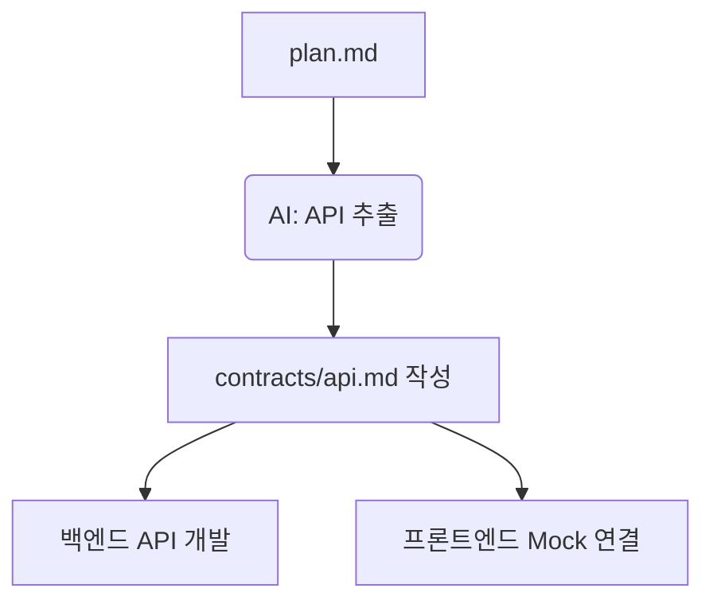

# 14강: OpenAPI 명세서 연동

## 개요
프론트엔드와 백엔드의 소통 오류를 원천 차단하기 위해, SpecKit 계획 단계에서 강제적으로 OpenAPI(Swagger 호환) 규격의 API 명세서를 생성해내는 방법론입니다.

## 학습목표
- `contracts/api.md` 산출 개념 이해
- RESTful 일관성 및 엔드포인트 통제 훈련
- API-First 패러다임 적용

## 사용형식 / 메뉴얼



## 직접해보기

**Step 1. OpenAPI 템플릿 지시**
AI에게 "계획서(plan)를 바탕으로 OpenAPI 3.0 규격에 맞는 API 명세서(`contracts/api.md`)를 도출해줘"라고 명령합니다.

**Step 2. 프론트/백 병렬 작업**
산출된 API 명세를 바탕으로, 프론트엔드는 Mocking 데이터 작업을 시작하고 백엔드는 엔드포인트 구현 태스크(`tasks.md`)를 시작하도록 유도합니다.

## 실전 예제

**예제 1. OpenAPI 3.0 명세서 자동 추출**
기획 및 설계서(`plan.md`)에서 REST API 표준 규격 파일을 뽑아냅니다.
```bash
specify generate api --format openapi3 --output contracts/api.yaml
```

**예제 2. 프론트엔드 API Mock Server 구동**
추출된 `api.yaml`을 바탕으로 즉석에서 더미 데이터를 반환하는 서버를 띄웁니다.
```bash
npx prism mock contracts/api.yaml
```

**예제 3. Frontend / Backend TS 타입 추출**
명세서를 바탕으로 타입스크립트 인터페이스 코드를 자동 생성합니다.
```bash
specify codegen types --input contracts/api.yaml --output src/types/api.ts
```

## Tips 
- **주의사항**: API 응답 필드(JSON 구조)를 명확하게 사전에 합의(도출)해야 차후 수정이 발생하지 않습니다.
- **다이나믹한 활용법**: AI에게 해당 `api.md`를 읽고 "프론트엔드용 Axios 훅(Hook) 코드 전체를 자동 생성해줘"라고 명령하세요.
- **다음강좌 소개**: AI가 절대 뚫지 못할 철옹성을 만드는 **[15강: Constitution 기반 강력한 보안 정책 주입]** 입니다.
