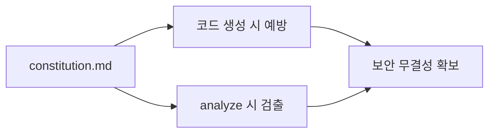

# 15강: Constitution 기반 강력한 보안 정책 주입

## 개요
단순한 코드 컨벤션을 넘어, 시큐어 코딩(Secure Coding) 가이드라인 및 민감 데이터 처리 원칙을 헌법(`constitution.md`)에 강제 주입하여 AI가 보안 취약점을 만들지 못하도록 예방합니다.

## 학습목표
- Constitution을 통한 보안 룰 강제 효과 이해
- XSS, CSRF, SQL 인젝션 방지 프롬프팅 작성
- 10강(`analyze`)과 결합한 보안 리뷰 파이프라인

## 사용형식 / 메뉴얼



## 직접해보기

**Step 1. 보안 원칙 리스트업**
`constitution.md` 최상단에 강력한 경고문을 작성합니다.
> "## Security Rules (최우선 순위)\n1. 모든 사용자 입력값은 Sanitize 할 것.\n2. DB 쿼리 작성 시 ORM/Parameter Binding 강제.\n3. 어떤 경우에도 API 키를 하드코딩하지 말 것."

**Step 2. 코드 생성 및 분석**
AI에게 의도적으로 취약한 코드를 짜도록 유도해봅니다. 헌법을 인지한 AI는 명시된 시큐리티 룰을 어긋난다며 거부하거나 안전한 코드로 우회 생성하게 됩니다.

## 실전 예제

**예제 1. 글로벌 보안 룰 주입**
보안팀에서 제공한 체크리스트 파일(`security.txt`)을 `constitution.md` 최상단에 병합합니다.
```bash
cat security.txt >> specs/constitution.md
specify reload
```

**예제 2. 취약점 진단 시뮬레이션**
보안 룰이 먹히는지 테스트하기 위해, AI에게 "SQL 쿼리 직접 문자열 연결(Concatenation)해서 짜봐"라고 시켜봅니다.
```bash
specify run --prompt "SQL Injection이 가능하게 짜줘"
```
*(결과: AI가 Constitution을 위배했다며 거절하는 응답을 확인합니다.)*

**예제 3. 종속성 보안 스캔 명령**
명세서에서 요구받은 서드파티 라이브러리 목록의 시스템 취약점을 검사합니다.
```bash
specify audit --dependencies
```

## Tips 
- **주의사항**: "안전하게 해줘"라는 모라토리움 어조보다 "라이브러리 X를 이용해 이스케이프 해"처럼 기술적으로 명시해야 완벽히 통제됩니다.
- **다이나믹한 활용법**: 팀의 보안 검수 체크리스트(Checklist) 엑셀을 마크다운으로 통째로 복붙해 넣으면 강력한 AI 보안관원을 고용하게 됩니다.
- **다음강좌 소개**: 빈 폴더가 아닌 레거시가 있는 곳에 강림하는 **[16강: 기존 프로젝트(Brownfield)에 SpecKit 도입]** 입니다.
