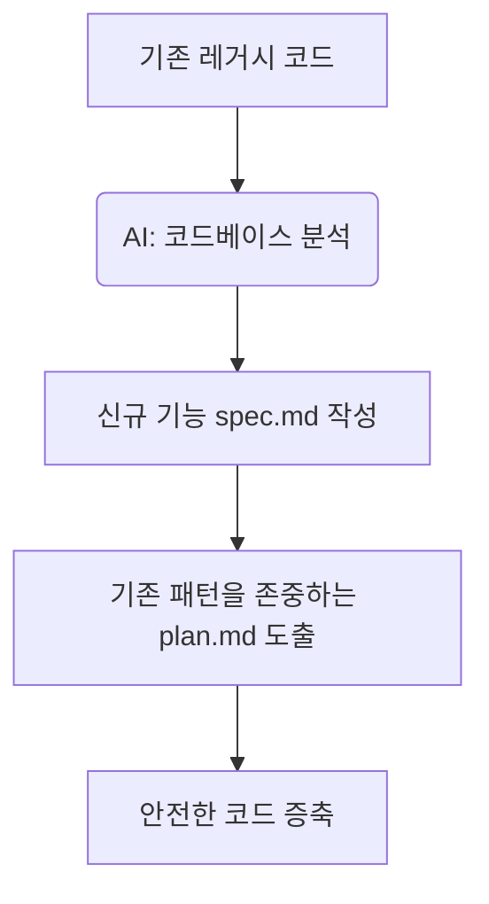

# 16강: 기존 프로젝트(Brownfield)에 SpecKit 도입

## 개요
아무것도 없는 백지 상태(Greenfield)가 아닌, 이미 수백 개의 코드와 로직이 존재하는 기존 프로젝트(Brownfield)에 SpecKit을 안전하게 끼워 넣고 확장하는 방법을 익힙니다.

## 학습목표
- 레거시(Legacy) 코드베이스 컨텍스트 유지법 이해
- 기존 코드를 기반으로 한 `plan.md` 수립 훈련
- SpecKit 점진적 확장(Strangler Fig 패턴) 전략 도입

## 사용형식 / 메뉴얼



## 직접해보기

**Step 1. 분석 및 헌법 자동화**
기존 프로젝트 루트에서 `specify init` 후 AI에게 다음을 명합니다.
> "현재 코드베이스 구조와 코딩 스타일을 전체 분석해서 역으로 `constitution.md` 초안을 작성해줘."
이로서 인간이 룰을 짜는게 아니라 AI가 레거시의 룰을 흡수합니다.

**Step 2. 신규 피처(Feature) 부착**
신규 개발 시 "새로운 결제 모듈을 추가할 건데, 기존 `src/services` 디렉토리 패턴과 형식을 그대로 복제해서 `plan`과 `tasks`를 수립해결제"라고 컨택스트 주입을 합니다.

## 실전 예제

**예제 1. 기존 코드베이스에서 헌법(Constitution) 역추출**
수동으로 작성하지 않고 레거시 코드를 스캔하여 룰을 뽑아냅니다.
```bash
specify extract constitution --source src/ --output specs/constitution.md
```

**예제 2. 레거시 종속성 스펙(Spec)화**
기존에 사용 중인 `package.json`이나 `requirements.txt`를 읽고 프로젝트 환경 명세를 문서화합니다.
```bash
specify extract env --file package.json --output specs/env-setup.md
```

**예제 3. 특정 폴더만 타겟팅하는 점진적 샌드박싱**
프로젝트 전체가 아닌 특정 신규 디렉토리(`src/new-feature`)에만 특수 룰을 강제합니다.
```bash
specify init --dir src/new-feature --isolated
```

## Tips 
- **주의사항**: 한 번에 기존 코드 전체를 리팩토링하려고 하면 AI가 기억상실증에 걸립니다. 범위를 좁히세요.
- **다이나믹한 활용법**: 기존의 모놀리식 구조를 MSA나 다른 프레임워크로 옮길 때, 기존 로직을 명세서(`spec.md`)로 먼저 전부 추출시킨 뒤, 새 프로젝트에 붙여넣어 번역기로 사용할 수 있습니다.
- **다음강좌 소개**: 버그 없는 탄탄한 코드를 위한 **[17강: 테스트 주도 개발(TDD) 결합 워크플로우]** 입니다.
