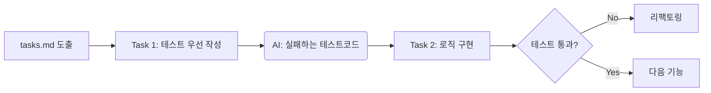

# 17강: 테스트 주도 개발(TDD) 결합 워크플로우

## 개요
기능 구현의 태스크(`tasks.md`)를 쪼갤 때, 로직 코드를 생산하기에 앞서 '테스트 코드(Test Code)'를 무조건 먼저 생성하도록 지시하여 TDD 사이클을 AI에 접목하는 기법입니다.

## 학습목표
- TDD 개념의 SpecKit 내장화
- 테스트 코드 선제 작성을 통한 AI 환각 방어력 극대화
- Red-Green-Refactor 루프 통제법

## 사용형식 / 메뉴얼



## 직접해보기

**Step 1. 템플릿/헌법 세팅**
`constitution.md`에 명시합니다: "모든 로직 구현은 TDD 규칙을 따른다. 비즈니스 로직 작성 전 파일명.test.ts를 반드시 먼저 작성하고 뼈대를 잡을 것."

**Step 2. 태스크 리뷰**
`tasks.md`가 생성되었을 때 항목의 순서가 TDD 리듬에 맞는지 확인합니다.
- [ ] 1.1 로그인 유효성 검사 파일 `login.test.ts` 작성 (Fail 상태)
- [ ] 1.2 로그인 유효성 로직 `login.ts` 작성 및 통과 확인

**Step 3. 이행(Implement)**
AI에게 이 순서대로만 진행하게 하여 스스로 테스트를 짜고 오류를 잡은 뒤 완료 핑퐁을 치게 합니다.

## 실전 예제

**예제 1. BDD 스타일 테스트 케이스 추출**
명세서(`spec.md`)의 요구사항을 단위 테스트 뼈대 코드(Test Stubs)로 렌더링합니다.
```bash
specify generate tests --spec specs/spec.md --framework jest --output src/tests/
```

**예제 2. 테스트 실패 시 무한 루프 구현 모드**
실패하는 테스트를 통과할 때까지 AI가 코드를 고치고 돌리기를 반복하게 만듭니다.
```bash
specify implement --tdd --test-cmd "npm test" --max-retries 5
```

**예제 3. 커버리지(Coverage) 목표치 설정**
AI에게 특정 테스트 커버리지 도달을 태스크 통과 조건으로 겁니다.
```bash
specify implement --require-coverage 80
```

## Tips 
- **주의사항**: UI 컴포넌트까지 전부 TDD를 강요하면 생산성이 저하될 수 있습니다. 비즈니스 코어 로직(상태 관리, 계산, API)에만 엄격히 적용하세요.
- **다이나믹한 활용법**: BDD (Behavior Driven Development) 방식으로 사전에 기획한 `spec.md`의 문장을 그대로 `describe`, `it` 블록에 넣도록 유도하세요.
- **다음강좌 소개**: 거대 앱 제작을 위한 쪼개기 기술 **[18강: 대규모 개발 시 컨텍스트 관리]** 입니다.
