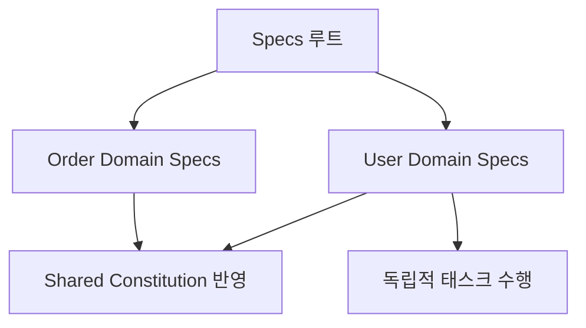

# 18강: 대규모 개발 시 컨텍스트 관리

## 개요
대규모 웹 플랫폼이나 엔터프라이즈 앱을 짤 때 AI의 프롬프트 컨텍스트 윈도우 한계(Context Limit)로 인해 전체 코드를 기억하지 못하는 문제를 '도메인 단위 분할'을 통해 영리하게 회피합니다.

## 학습목표
- 컨텍스트(Context) 과부하 현장 이해 및 증상 파악
- 도메인 주도 설계(DDD) 기반의 `specs` 폴더 샤딩(Sharding) 기법
- 모듈 격리를 통한 안정적인 대형 프로젝트 빌드

## 사용형식 / 메뉴얼



## 직접해보기

**Step 1. 도메인 분할 폴더링**
단일 `spec.md`에 결제, 유저, 배송, 장바구니를 모두 넣지 못하게,
`specs/users/`, `specs/orders/`, `specs/products/` 로 폴더를 나누고 각각 독립적인 `plan`과 `tasks`를 산출하게 합니다.

**Step 2. AI에게 시야 제한하기**
코딩 중 지시를 내릴 때 다음과 같이 울타리를 칩니다.
> "지금부터 너는 `specs/orders/*` 도메인에 대한 정보만 참고해. 유저 계정쪽의 로직은 이미 Mock으로 열려있다고 가정하고 이 영역 안에서만 태스크를 돌려라."

## 실전 예제

**예제 1. 서브 도메인(Sub-Domain)별 독립 명세 환경 트리거**
루트 디렉토리 대신 특정 도메인(Order)만을 컨텍스트로 잡아 태스크를 실행합니다.
```bash
specify run --context specs/orders/ --ignore specs/users/
```

**예제 2. 공통 도메인(Core) 지식 주입**
도메인이 분리되어 있어도, 핵심 공통 로직(auth, logging 등)은 항상 읽히도록 글로벌 참조 설정합니다.
```bash
specify config set globalContext "specs/core/"
```

**예제 3. 명세서 간의 의존성 차트 시각화**
다수의 `spec.md`가 얽혀 있을 때, 파일 간 종속성을 Mermaid 다이어그램으로 뽑아냅니다.
```bash
specify map dependencies --export specs/dependency-map.md
```

## Tips 
- **주의사항**: 서로 다른 도메인과 데이터 교환이 필요할 때는 `common` 또는 `core` 폴더의 인터페이스 파일을 서로가 import만 하도록 종속성을 끊어야 AI가 헷갈려하지 않습니다.
- **다이나믹한 활용법**: 공통 헌법(`constitution.md`)은 프로젝트 루트에 두어 전체가 상속받게 하고, 각 도메인 안에는 세부 규칙(`specs/orders/order-rule.md`)을 따로 두면 완벽합니다.
- **다음강좌 소개**: 개발이 끝난 후 백오피스 자동화를 위한 **[19강: CI/CD 파이프라인 정합성 검토]** 입니다.
