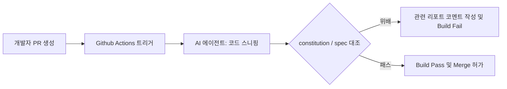

# 19강: CI/CD 파이프라인 정합성 검토

## 개요
완성된 코드가 개발팀 메인 브랜치로 병합(Merge)되기 전, 로컬에서 수동으로만 돌리던 `/analyze` (정합성 검증)를 Github Actions 등 자동화 파이프라인에 이식하는 단계입니다.

## 학습목표
- Spec 기반의 자동화된 로봇 피어 리뷰(Peer Review) 구축
- CI 파이프라인 상에서의 헌법 위배 사전 차단
- 지속적 통합 환경(CI) 최적화 테크닉

## 사용형식 / 메뉴얼



## 직접해보기

**Step 1. Action YML 작성**
CI 환경 설정 파일(`.github/workflows/spec-review.yml`)에서 `pull_request` 이벤트 시 AI 코드 리뷰 스크립트를 백그라운드로 실행하게 배치합니다.

**Step 2. AI CLI 모드 활용**
명령어를 CI 내에서 실행하여 리뷰 결과물 리포트를 텍스트로 뽑아내고, 이를 curl이나 Github CLI를 사용해 Pull Request 커멘트로 자동 등록시켜버립니다.

## 실전 예제

**예제 1. Github Actions 워크플로우 파일 생성**
CI 파이프라인에서 자동으로 SpecKit 리뷰가 돌아가도록 설정 템플릿을 추가합니다.
```bash
specify export workflow --provider github --out .github/workflows/speckit.yml
```

**예제 2. 델타(Delta) 분석 모드 실행**
전체 파일이 아닌 Git에서 변경된(Modified) 파일만을 대상으로 정합성 검사를 돌려 속도를 높입니다.
```bash
specify analyze --diff HEAD~1
```

**예제 3. 비침투적(Non-blocking) 경고 모드**
리뷰 리포트를 뽑되, 빌드 자체를 실패(Fail)시키지 않고 코멘트만 달게 설정합니다.
```bash
specify analyze --strict false --output pr-comment.md
```

## Tips 
- **주의사항**: CI 내에서 LLM API(OpenAI 등)를 호출해야 하므로, Secret Key 관리에 철저히 신경써야 합니다.
- **다이나믹한 활용법**: "PR로 추가/수정된 파일만 한정적으로 검사해"라고 Delta(차분) 검사를 지시하여 토큰 비용을 아끼고 속도를 향상 시킬 수 있습니다.
- **다음강좌 소개**: 배운 모든 지식을 하나로 모아 빛의 속도로 스타트업을 만드는 마법, 마지막 **[20강: 1인 AI 비즈니스 창업을 위한 초고속 사이클 완성]** 입니다.
