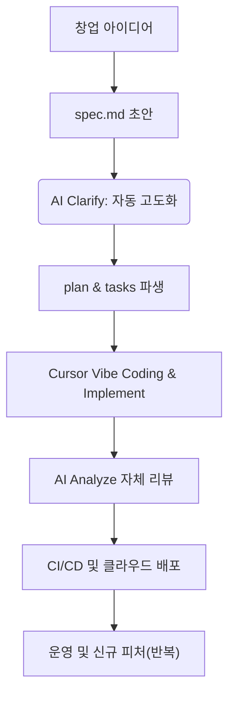

# 20강: 1인 AI 비즈니스 창업을 위한 초고속 사이클 완성

## 개요
기초 환경 셋업, 명세 주도 기획, AI 코드 통제, 그리고 CI/CD 보안 검증까지. 지금까지 배운 모든 SpecKit 워크플로우를 마스터 피스 코스에 집약시켜, 1인 개발자가 상용 비즈니스 প্রোডাক্ট를 최단 기간에 뽑아내는 마스터 워크플로우를 결속합니다.

## 학습목표
- End-to-End SDD 마스터 사이클 정립
- 1인 개발/창업의 고질적 한계(단일 장애점) 극복을 위한 AI 자원화
- 시스템이 시스템을 만들게 하는 자동화 철학 체화

## 사용형식 / 메뉴얼



## 직접해보기

이 챕터는 실습보다 여러분의 프로덕트 리스트를 꺼낼 시간입니다.
**Step 1. 무한 궤도 돌리기**
아이디어 폴더를 `specify init`으로 파내고, 헌법을 세운 뒤 AI와 티키타카를 시작하세요.
개발자가 해야 할 일은 '의사 결정'과 'Tasks 통과 체크인' 승인뿐, 단순 타이핑은 모두 기계에 위임합니다.

**Step 2. 템플릿과 노하우의 에셋(Asset)화**
수차례 겪었던 시행착오 헌법과 자신만의 `templates`를 외부에 저장해두고, 새로운 창업 아이템이 나올 때마다 해당 보일러플레이트를 복원해 초고속 레이스를 달립니다.

## 실전 예제

**예제 1. 원클릭 스캐폴딩(Scaffolding) 매크로 실행**
미리 저장해 둔 나만의 창업용 "풀스택 + 인증 + DB + SpecKit" 보일러플레이트를 단숨에 불러옵니다.
```bash
specify scaffold --template "my-startup-stack-v1" --dest ./new-startup
```

**예제 2. 비즈니스 기획서 자동 확충 스크립트**
단 한 줄의 아이디어만 적힌 `idea.txt`에서 `spec`, `plan`, `tasks` 까지 연속으로 파이프라인을 돌립니다.
```bash
specify pipeline run --input idea.txt --auto-approve
```

**예제 3. AI 기반 자동 릴리즈 노트(Release Notes) 작성**
완료된 `tasks.md` 항목들과 완료 코드를 바탕으로 깔끔한 마크다운 패치노트를 산출합니다.
```bash
specify generate release-notes --from specs/tasks.md --out CHANGELOG.md
```

## Tips 
- **주의사항**: 통제되지 않은 코드 복붙(Vibe Coding)의 쾌감에 빠지지 마세요. 결국 문서(Spec)로 룰을 쥔 자가 승리합니다.
- **다이나믹한 활용법**: SpecKit 시스템으로 만든 프로덕트 자체가 여러분의 거대한 포트폴리오이자, AI를 경영할 줄 아는 "시스템 엔지니어"임을 증명하게 됩니다.
- **최종 인사**: 여기까지 긴 여정을 오시느라 고생 많으셨습니다. 이제 다음 파트인 **[Part 3: 실전]** 21강부터는 지금까지 수련한 마스터 워크플로우를 사용해 실제 쇼핑몰, 인증시스템, 무한 메뉴트리 등을 격파해 나가겠습니다!
