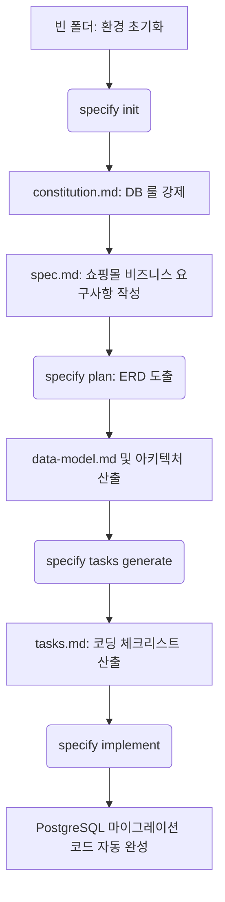

# 21강: 쇼핑몰 데이터베이스 설계 (End-to-End 실전 시뮬레이션)

## 개요
이전 기초/고급 과정에서 배운 모든 지식을 총동원하여, 쇼핑몰의 복잡한 핵심 데이터 모델(상품, 장바구니, 주문, 결제)을 백지 상태에서 설계해 봅니다. SpecKit 패키지 환경 설치부터 최종 마이그레이션 SQL 코드를 구동하기까지의 전 과정을 튜토리얼 형태로 완벽하게 시뮬레이션합니다.

## 학습목표
- 백지(Greenfield) 상태에서 SpecKit 초기화 및 헌법 세팅
- 쇼핑몰 핵심 도메인(`spec.md`) 마크다운 설계법 마스터
- AI가 `plan.md` 및 `tasks.md`를 산출하여 최종 DB 코드를 도출하는 통제 프로세스 습득

## 사용형식 / 메뉴얼
실전 E2E(End-to-End) 파이프라인의 전체 데이터 흐름은 다음과 같습니다.



## 직접해보기
지금부터 완전히 비어있는 폴더에서 완벽한 데이터베이스 코드가 완성되는 순간까지 차근차근 따라해 보세요.

**Step 1. 환경 준비 및 SpecKit 설치 (처음부터)**
빈 프로젝트 폴더를 만들고 SpecKit 도구를 시스템에 전역 설치합니다.
```bash
mkdir shop-database-project && cd shop-database-project
# uv 패키지 매니저가 설치되어 있다고 가정하고 전역 CLI 설치
uv tool install specify-cli
# 현재 경로를 speckit 프로젝트로 초기화
specify init .
```
이 시점에서 `.specify` 폴더 생태계와 `specs/` 폴더 템플릿들이 즉시 세팅됩니다.

**Step 2. 프로젝트 헌법(Constitution) 정의**
AI가 마음대로 엉뚱한 DB 문법으로 설계하지 못하도록 PostgreSQL과 명명 규칙을 `constitution.md`에 단호하게 박아둡니다.
```bash
mkdir -p specs
cat << 'EOF' > specs/constitution.md
# Database Constitution
1. 인프라: PostgreSQL 16 
2. 네이밍 컨벤션: 테이블명과 컬럼명은 반드시 `snake_case`로 통일한다.
3. 무결성 규칙: 삭제 시 외래키 참조 무결성을 위해 `ON DELETE CASCADE` 또는 `RESTRICT`를 조건에 맞게 명시한다.
4. 타임스탬프: 모든 테이블에는 `created_at`, `updated_at` 필드가 기본으로 존재해야 한다.
EOF
```

**Step 3. 비즈니스 요구사항(Spec.md) 작성**
이제 "무엇을 만들지" 쇼핑몰의 4대 도메인 요구사항을 기술합니다. 기술적인 언어나 엔드포인트는 뺍니다.
```bash
cat << 'EOF' > specs/spec.md
# 쇼핑몰 데이터 모델 요구사항

## 1. 유저 및 상품 (User & Product)
- 고객(User)은 이름, 이메일, 비밀번호, 가입일 정보를 가진다.
- 상품(Product)은 고유 식별자, 상품명, 가격, 남은 재고(stock), 상세설명을 가진다.

## 2. 장바구니 (Cart)
- 특정 고객은 자신의 장바구니에 여러 상품을 담을 수 있다. 
- 담을 때는 상품 자체와 '수량' 정보가 필요하다.

## 3. 주문 및 결제 (Order & Payment)
- 고객이 장바구니에 담긴 내역을 기반으로 '주문(Order)'을 확정 생성한다.
- 주문 시 총 결제 금액이 산출되어야 한다.
- 실제 결제가 완료되면(Payment) 주문 상태 속성이 '결제 완료'로 변경되며 상품의 재고가 차감된다.
EOF
```

**Step 4. 계획 및 모델링 지시 (Plan)**
방금 짠 요구사항과 헌법을 바탕으로 **AI 에이전트 채팅창(Cursor 등)**에 ERD 구조를 모델링하라고 프롬프트를 입력합니다. (주의: 터미널 명령어가 아닙니다)
```text
현재 작성된 spec.md와 constitution.md를 읽고 data-model.md를 생성해줘. ERD 다이어그램에 집중해서 만들어줘.
```
명령후 렌더링이 끝나면 `specs/data-model.md` 파일이 생성되며, 내부에는 `spec.md` 내용에 기반하여 Mermaid 다이어그램으로 완벽한 ERD 관계도(Foreign Key 포함)가 그려집니다.

**Step 5. 태스크 분해 (Tasks)**
구조가 확보되었으니, 이를 실제 DB 쿼리 문법으로 옮기는 '실행 가능한 코딩 단위'로 쪼개달라고 **AI 채팅창에 지시**합니다.
```text
방금 만든 data-model.md를 실제 DB 스키마 코드로 구현하기 위한 tasks.md를 생성해줘. 단위는 최대한 작게 분할해줘.
```
도출된 `specs/tasks.md`에는 다음과 같이 사람이 검수할 수 있는 체크리스트가 산출됩니다.
- [ ] 1. `users` 및 `products` 테이블 스키마 작성 SQL (제약조건 포함)
- [ ] 2. `carts` 장바구니 연결 테이블 및 외래키 제약조건 작성 SQL
- [ ] 3. `orders` 및 `payments` 결제 상태 포함 테이블 작성 SQL

**Step 6. 실제 코드 출력 및 파일 생성 (Implement)**
생성된 태스크를 위에서부터 1개씩 순차적으로 렌더링하도록 **AI 채팅창에 지시**합니다.
```text
작성된 tasks.md의 첫 번째 항목부터 차례대로 스키마 구현 작업(Implement)을 진행해줘. 한 번에 하나씩만 진행하고 내가 확인하면 다음 항목으로 넘어가줘.
```
AI가 프로젝트 루트의 `migrations/` 같은 폴더를 자동 생성하며 `01_init_shop_schema.sql` 스크립트를 짠 뒤 대기합니다. 통과 표시를 해주면 이어서 모든 테이블 코드를 뽑아냅니다. 중간에 문법 에러가 있다면, 언제든 `specify fix` 커맨드로 즉각 픽스(Self-healing)를 유도하세요.

**Step 7. 샘플 데이터 통제 및 CRUD 검증 (Data Handling)**
테이블 생성이 완료되었으므로, 실제 서비스 시뮬레이션을 위해 각 테이블당 10개의 샘플 데이터를 구성하여 추가, 수정, 삭제(CRUD) 과정을 거칩니다. 외래 키 제약 조건(`ON DELETE RESTRICT` 등)을 직접 확인하는 과정입니다. 
제공된 `samples/` 디렉토리 내의 SQL 파일들을 차례대로 실행하여 데이터를 조작해 봅니다.
```bash
# 1. 샘플 데이터 추가 (INSERT)
psql -U postgres -d shop_db -f ../samples/01_insert_samples.sql

# 2. 샘플 데이터 수정 (UPDATE 및 updated_at 트리거 수동 확인)
psql -U postgres -d shop_db -f ../samples/02_update_samples.sql

# 3. 샘플 데이터 삭제 (DELETE 및 참조 무결성 순서 확인)
psql -U postgres -d shop_db -f ../samples/03_delete_samples.sql
```

## 실전 예제

**예제 1. Prisma ORM 특화 요구사항 추가**
순수 SQL 쿼리 대신 현재 유행하는 Prisma ORM으로 스키마 코드를 뽑아내고 싶다면, 헌법(`constitution.md`)에 단 한 줄을 샌드위치로 끼워넣습니다.
```bash
echo "5. 데이터베이스 구축 파트는 철저히 Prisma ORM을 사용하며 schema.prisma 파일 규격을 준수한다." >> specs/constitution.md
```
그리고 **AI 채팅창**에 다음과 같이 지시합니다.
```text
헌법이 방금 업데이트 되었으니 이를 반영해서 모델링(Plan)을 다시 수행해줘.
```

**예제 2. 요구사항 구체화(Clarify)를 통한 모호성 극복**
결제 취소, 품절 시 로직을 고려하지 않고 Step 3 원문만 줬다면, 개발 전 기획을 단단히 메우도록 **AI 채팅창에 지시**합니다.
```text
spec.md를 분석해서 예외상황(결제 취소, 시스템 다운 등 결제 예외상황)에 대한 엣지 케이스들을 나에게 질문(Clarify)해줘.
```
*(장바구니에서 상품이 삭제되었을 때나 시스템 다운 시 재고 복구 정책 등을 AI가 친절하게 역으로 질문하며 기획을 다져줍니다.)*

**예제 3. ERD 의존성 충돌 검사 (Analyze)**
SQL 코드가 전부 짜여진 뒤, 외래키 연결에서 누락된 타임스탬프 필드가 혹시나 없나 횡단 검사를 **AI 채팅창에 요구**합니다.
```text
migrations 폴더에 짜여진 모든 SQL 파일들이 constitution.md 규칙을 위반한 건 없는지 철저하게 검증(Analyze)해서 리포트를 작성해줘.
```
*(예: "products 테이블 쿼리에 updated_at이 누락되어 헌법 4조를 위반했습니다."라는 리포트를 얻을 수 있어 코드 신뢰도를 100%로 끌어올립니다.)*

## Tips 
- **주의사항**: 위 시뮬레이션 중 `specify implement --single-step` 시, AI가 1번 항목만 처리하고 대기 상태에 들어갑니다. 사람이 코드가 잘 짜였는지 확인한 후 다음 항목으로 통과(`[x]`) 시켜주세요.
- **다이나믹한 활용법**: 만약 요구사항 도메인이 훨씬 커진다면 (쿠폰 서비스, 배송 도메인 등등), `specs/` 아래 서브 폴더로 `orders`, `products`를 분할(Sharding)해서 각각 명령을 내리면 AI의 토큰 한계 우려 없이 빠르게 파이프라인이 돕니다.
- **성능을 높이는 방법**: 초기 `plan` 단계에서 ERD 다이어그램이 잡힌 직후, 데이터 타입 필드(예: userId는 INT가 아닌 UUID 구조)를 인간이 `data-model.md`에 조금만 손봐주고 나서 `tasks`를 뽑게 하면, 이후로 나오는 모든 SQL 퀄리티가 환각 없이 압도적으로 올라갑니다.

## 다음강좌 소개
다음 실습 파트인 **[22강: 로그인 RBAC 기반 인증/권한 시스템 개발]** 에서는 이번에 성공적으로 만든 쇼핑몰 데이터베이스 스키마 레이어 위에, '관리자(Admin)'와 '일반 유저(User)'를 명확히 구분하여 자원 접근을 철통같이 통제하는 강력한 보안 기반의 백엔드 시스템을 고도화 해보겠습니다.
