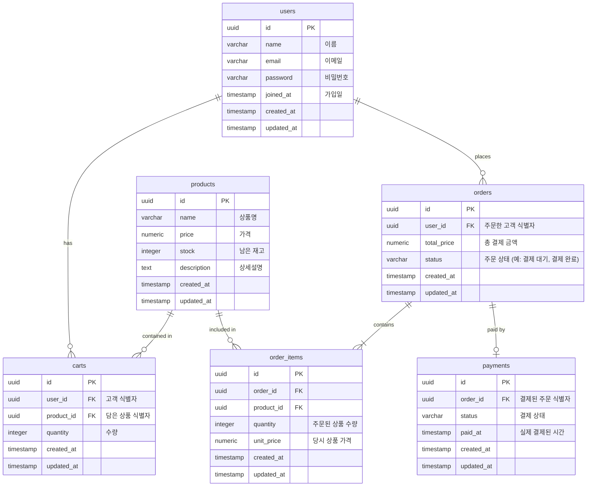

# 쇼핑몰 데이터 모델 (ERD)

본 문서는 `spec.md`의 요구사항과 `constitution.md`의 데이터베이스 제약사항(PostgreSQL 16, snake_case 병합, 타임스탬프 등)을 반영한 마크다운 기반의 데이터 아키텍처 모델입니다.

## 1. 개체 관계도 (Entity-Relationship Diagram)

## 2. 제약사항 및 외래키 (Foreign Key Constraints) 정책
`constitution.md`의 참조 무결성 규칙(`ON DELETE CASCADE` 등)에 따라 테이블 간 연결은 다음과 같이 강제되어 스키마를 도출해야 합니다.

- **`carts.user_id`**: `users(id)` 연결. 사용자가 탈퇴(삭제)되면 장바구니도 연쇄 삭제되도록 `ON DELETE CASCADE`를 필수 선언합니다.
- **`carts.product_id`**: `products(id)` 연결. 상품이 물리적으로 삭제될 일이 발생하면 사용자의 장바구니 품목 테이블에서도 일괄 삭제 처리되도록 `ON DELETE CASCADE`를 지정합니다.
- **`orders.user_id`**: `users(id)` 연결. 탈퇴한 고객의 주문 내역도 보존해야 한다면 주문이 함부로 날아가지 않도록 `ON DELETE RESTRICT`(또는 정책에 따른 SET NULL) 정책을 기본으로 사용합니다.
- **`order_items.order_id`**: `orders(id)` 연결. 주문 내역 자체가 날아가면 매핑 테이블도 불필요하므로 `ON DELETE CASCADE`로 연쇄 삭제합니다.
- **`order_items.product_id`**: `products(id)` 연결. 과거에 산 상품이 단종되어 레코드 자체가 지워졌을 때, 기존의 주문 내역에서 참조하는 상품명이 날아가면 안 되므로 `ON DELETE RESTRICT`를 지정하여 상품 자체의 삭제를 1차 통제합니다.
- **`payments.order_id`**: `orders(id)` 연결. 결제 내역과 주문 간 사이클릭한 강한 라이프사이클을 갖지만, 결제 기록의 보존이 중요하므로 `ON DELETE RESTRICT` 처리를 통해 원본 주문을 삭제하지 못하게 차단합니다.

## 3. 핵심 비즈니스 로직 (재고 차감)
`spec.md` 요구사항인 **"결제가 완료되면 재고가 차감된다"**의 경우, 추후 생성될 SQL 트랜잭션 코드에 반드시 다음 사항이 포함되어야 합니다.
1. `payments` 테이블의 `status`가 '결제 완료(COMPLETED)'로 Insert/Update 됨.
2. 매핑된 `order_items`의 레코드들을 훑음.
3. 해당 품목의 `quantity`만큼 `products` 테이블의 `stock`에서 빼는 원자성(Atomic) Update 쿼리 실행 수행 보장.

## 4. 데이터베이스 벤더 특화 정책 (PostgreSQL)
`constitution.md`에서 인프라를 PostgreSQL 16으로 지정함에 따라, 스키마 구현 시 다음 특징을 필수로 사유와 함께 반영하게끔 모델링합니다.
- **Timestamp 자동 갱신 트리거**: MySQL의 `ON UPDATE CURRENT_TIMESTAMP`와 같은 구문이 PostgreSQL에는 내장되어 있지 않습니다. 따라서 데이터 정합성을 위해 항상 첫 번째 테이블(예: `users`) 스키마를 짤 때 `updated_at`을 현재 시간으로 강제 치환해주는 **PL/pgSQL 트리거 공용 함수**를 선언해야 합니다.
