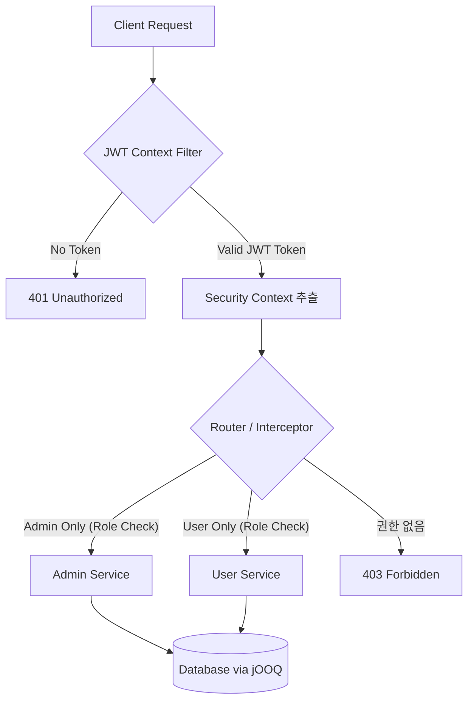

# 22강: 로그인 RBAC 기반 인증/권한 시스템 개발

## 개요
21강에서 성공적으로 설계된 쇼핑몰 데이터베이스 스키마 레이어 위에, 보안의 핵심인 인증(Authentication)과 인가(Authorization)를 도입합니다. 권한 기반 접근 통제(Role-Based Access Control, RBAC) 시스템을 설계하고, '관리자(Admin)'와 '일반 유저(User)'를 명확히 구분하여 자원 접근을 철저하게 제어하는 강력한 보안 기반의 백엔드 시스템을 고도화 해보겠습니다.

## 학습목표
- RBAC(Role-Based Access Control) 권한 모델 데이터베이스 구조 이해
- AI와 함께 로그인 및 JWT 인증/인가 요구사항 명세 작성 (`spec.md`)
- Kotlin, Spring Boot, jOOQ 환경 기반의 강력한 서버사이드 엔드포인트 구현 계획(`plan.md`) 수립

## 사용형식 / 메뉴얼
인증 여부와 인가 역할에 따른 자원 접근 통제가 이루어지는 시스템 구조 흐름은 다음과 같습니다.



## 직접해보기
이번 챕터에서는 **Kotlin + Spring Boot + jOOQ** 스택을 목표로 하는 백엔드 구현 관점에서 AI에게 아키텍처 플랜을 수립하도록 명세서를 제공하는 방식을 학습합니다.

**Step 1. 역할 및 권한 헌법 (Constitution) 업데이트**
이전 `constitution.md` 파일에 보안 아키텍처 원칙을 주입합니다.
```bash
echo "5. 모든 API 인가는 RBAC 모델에 기반하며, Spring Security와 JWT 토큰을 활용한다." >> specs/constitution.md
echo "6. 데이터베이스 쿼킹 관리는 Kotlin과 jOOQ를 결합한 Typesafe 쿼리를 지향한다." >> specs/constitution.md
```

**Step 2. 권한 접근 요구사항 (Spec) 작성**
RBAC에 필요한 요구사항을 기획합니다.
```bash
cat << 'EOF' > specs/spec_rbac.md
# RBAC 및 인증 요구사항 통제 방식

## 1. 역할(Role) 및 권한 모델
- User 역할: 쇼핑몰 일반 구매자. 본인의 장바구니 및 주문결제 영역에만 접근 가능
- Admin 역할: 시스템 관리자. 전체 사용자, 상품 정보 등록/수정/삭제 권한 부여

## 2. API 인증
- 로그인을 성공하면 서버는 JWT (JSON Web Token) AccessToken을 반환한다.
- 이후 클라이언트는 Header에 토큰을 포함하여 전송해야 한다.

## 3. 예외 케이스
- 유효하지 않거나 만료된 토큰 -> 401 (Unauthorized) 에러 처리
- User가 Admin 전용 영역에 접근하려 할 경우 -> 403 (Forbidden) 차단 처리
EOF
```

**Step 3. 구현 플랜 도출 (Plan) 및 샘플 플랜 산출물 생성**
요구사항을 바탕으로 실제 애플리케이션 코드를 어떤 모듈 구조로 구현할지 **AI 채팅창**에 명령하여 `plan.md`를 산출합니다.

```text
현재 작성된 spec_rbac.md 파일을 기반으로 Kotlin, Spring Boot, jOOQ 환경에서 이 시스템을 구현하기 위한 백엔드 구조 및 아키텍처 설계 플랜(plan.md)을 작성해줘.
```

명령 후 생성되는 플랜 문서 예시는 아래와 같습니다. 아래 규격을 파일로 추출(`samples/plan.md`)하여 AI가 코딩 구현(`implement`)을 이어나갈 상세 지침으로 활용합니다.

> **[샘플 구조 도출결과: RBAC 시스템 구현 플랜]**
>
> **1. 기술 스택 및 라이브러리**
> - Language: Kotlin 1.9+
> - Framework: Spring Boot 3.2+
> - Security: Spring Security, jjwt (JWT Provider)
> - Database Access: jOOQ
> 
> **2. 패키지 아키텍처 (Domain-Driven)**
> ```text
> src/main/kotlin/com/shop/security/
> ├── config/
> │   ├── SecurityConfig.kt (스프링 시큐리티 설정 및 Role Endpoint 경로 선언)
> │   └── JooqConfig.kt (jOOQ DSLContext 빈 설정)
> ├── jwt/
> │   ├── JwtTokenProvider.kt (토큰 커스텀 생성 및 파싱)
> │   └── JwtAuthenticationFilter.kt (요청 전처리 미들웨어 필터)
> ├── repository/
> │   └── AuthRepository.kt (jOOQ를 이용한 user_roles, users 테이블 Typesafe 질의)
> └── service/
>     └── AuthService.kt (DB 로그인 로직 및 비밀번호 BCrypt 검증)
> ```
> 
> **3. 단계별 핵심 구현 계획**
> 1. **Data Layer (jOOQ)**: 사용자의 정보와 `user_roles` 테이블을 Join하여 User별 권한 Prefix(`ROLE_ADMIN`, `ROLE_USER`)를 추출하는 Repository 로직 작성. (이전 21강 데이터베이스를 토대로 자동 `generate` 된 Entity 활용)
> 2. **Filter Layer (Spring Security)**: `OncePerRequestFilter` 상속받은 `JwtAuthenticationFilter`가 모든 API 뎁스 최상단에 개입해 Header의 토큰을 파싱하고, 유효한 경우 사용자 권한 리스트를 SecurityContextHolder에 주입하는 코드 구성.
> 3. **Endpoint Layer**: 관리자 전용 코어 기능(상품 등록 등)에는 클래스 혹은 메서드에 `@PreAuthorize("hasRole('ADMIN')")` 어노테이션을 부착하여 방어.
> 4. **Exception Handling**: 커스텀 AuthenticationEntryPoint(401), AccessDeniedHandler(403) 전역 핸들링 구축.

## Tips 
- **주의사항**: jOOQ는 데이터베이스가 변경될 때마다 자동 코드 생성(Code Generation)을 돌려야 합니다. 21강의 스키마 파일들이 jOOQ Generate 태스크(build.gradle.kts)와 정상적으로 싱크가 맞춰지는 것이 먼저 검증되어야 합니다.
- **다이나믹한 활용법**: Role 외에도 좀 더 섬세한 권한 통제가 필요하다면, 권한(Permission) 테이블을 별개로 설계(예: `role_permissions` 조인)하여 권한 부여 시스템을 동적으로 확장할 수 있습니다.
- **성능을 높이는 방법**: jOOQ에서 권한 정보를 매번 DB에서 Select하여 매번 검증하는 대신, 로그인 시 발급되는 JWT Token Payload(클레임) 내부에 권한(roles) 리스트 문자열을 심어서 응답하면 DB 조회 비용 없이 서버가 Request당 독립적으로 무결성을 검증할 수 있어 I/O 성능이 크게 향상됩니다.

## 다음강좌 소개
다음 실습 파트인 **[23강: 메뉴 관리 시스템 개발]** 에서는 이렇게 보호된 어드민 통제 하에서, 무한 뎁스의 계층형 서비스 라우팅 및 카테고리 트리 메뉴를 구성하고 통합하여 실제 비지니스 구조에 어떻게 적용되는가를 경험할 수 있습니다.
